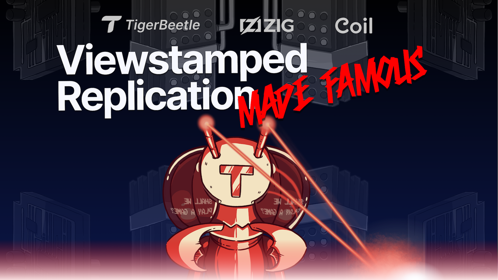

# Viewstamped Replication Made Famous
## A $20,000 Consensus Challenge
*Brought to you by [Coil](https://www.coil.com) and [TigerBeetle](https://tigerbeetle.com) in partnership with our friends at the [Zig Software Foundation (ZFS)](https://ziglang.org).*

> Do you love distributed systems, high availability and fault tolerance? Do network partitions and consensus protocols scare you? Have you watched War Games, Hackers and Sneakers more than once? Ever wanted to be a bounty hunter but didn't know where to start?

If you answered **Yes!!!** to any of the above, then this is your invitation to **get ready** to test *our skills* and learn consensus the fun way, by hacking TigerBeetle's implementation of the pioneering Viewstamped Replication and consensus protocol, and earn bounties for correctness and liveness bugs you discover, within scope, in a $20,000 consensus challenge beginning September 11, 2021 at 6pm UTC.

## Launching with a Special Live Event on September 11, 2021 at 6pm UTC

> Please join us for the live launch event of *Viewstamped Replication Made Famous*, live streaming on [Zig SHOWTIME's YouTube channel at 6pm UTC on September 11, 2021](https://www.youtube.com/watch?v=_Jlikdtm4OA).

The live event will pay tribute to the protocol and to the people who designed and revised it, and will feature **a special "behind the scenes" interview with Dr. Brian M. Oki, the author of the original Viewstamped Replication paper and dissertation in 1988, as well as a live roundtable discussion with Dr. James Cowling**, who revisited the protocol in 2012 with Turing Award-winner Prof. Barbara Liskov, and who lead the Storage Infrastructure team behind [Magic Pocket at Dropbox](https://www.wired.com/2016/03/epic-story-dropboxs-exodus-amazon-cloud-empire/).

All the "invariants", the rules and scope and bounty criteria of the challenge will be unveiled at the live launch event and then published here in the challenge repo, to apply for the duration of the challenge, which will run for at most three months, i.e. until 6pm UTC on December 11, 2021.

[Don't miss the inside track! Head on over to YouTube now and press "Set reminder" to be notified when we go live.](https://www.youtube.com/watch?v=_Jlikdtm4OA)

## Be Prepared!

> "I love it when a plan comes together!" - The A-Team's John "Hannibal" Smith

After setting [your YouTube reminder](https://www.youtube.com/watch?v=_Jlikdtm4OA), here are a few more things you can do before the challenge kicks off to **maximize your probability of an epic hack**:

* **Watch this repository to get notified** when we publish all the rules of the challenge (and the actual implementation) here in the repo towards the end of the live event. *Spoiler: Submissions will be as GitHub issues, so watching the repo as other people submit correctness and liveness bugs will also be a great way to learn and spark new ideas for you to explore.*

* **Learn more about TigerBeetle and Viewstamped Replication directly from the TigerTeam** by watching TigerBeetle’s Zig SHOWTIME talk: [A million financial transactions per second in Zig](https://www.youtube.com/watch?v=BH2jvJ74npM), where we also share more about Coil's mission for a better web, and how TigerBeetle fits in with the next generation of financial services being built around open payments standards and stacks such as [Interledger](https://interledger.org) and [Rafiki](https://github.com/interledger/rafiki).

* **Get even more excited about Viewstamped Replication** by reading the intuitive [Viewstamped Replication Revisited](http://pmg.csail.mit.edu/papers/vr-revisited.pdf) paper written by Turing Award-winner Barbara Liskov with James Cowling at MIT in 2012, and seeing how simple and elegant the protocol is.

* **Get hooked on Zig** and learn the language in a weekend by playing [Ziglings](https://github.com/ratfactor/ziglings)! *Tip: The consensus implementation that you will hack will be written in Zig and published here when the challenge launches. Zig has an easy learning curve with remarkable readability and simplicity. It can be faster, many times safer than C, and pure fun to program distributed systems in!*

* Once you understand the basics of Viewstamped Replication from the revised paper, dive into Brian M. Oki's seminal [Viewstamped Replication](http://pmg.csail.mit.edu/papers/vr.pdf) paper first published in 1988, and **see if you can spot how this already contains all the essential ingredients of consensus** underpinning later consensus protocols. *Go deep: To make the most of the live event, compare the tradeoffs between the 1988 and 2012 editions, and see how the "view changes" of both papers make sense when optimizing for different storage/network latencies.*

* Read the FAST '18 best paper-winning [Protocol-Aware Recovery for Consensus-Based Storage](https://www.usenix.org/system/files/conference/fast18/fast18-alagappan.pdf) by Ramnatthan Alagappan and Aishwarya Ganesan from UW-Madison, led by Remzi and Andrea Arpaci-Dusseau, **and learn how to implement consensus for a production system in the presence of real world storage faults.** You may be surprised at how broken many well-known systems are. *Bonus: Read anything you can from the Arpaci-Dusseau vanguard!*

* **Follow [@TigerBeetleDB](https://twitter.com/TigerBeetleDB) for more consensus clues** throughout the course of the challenge.

## Until Then...

*We wish you the best of luck in your preparations and can’t wait to see you at the launch event, as together we see Viewstamped Replication Made Famous!*
